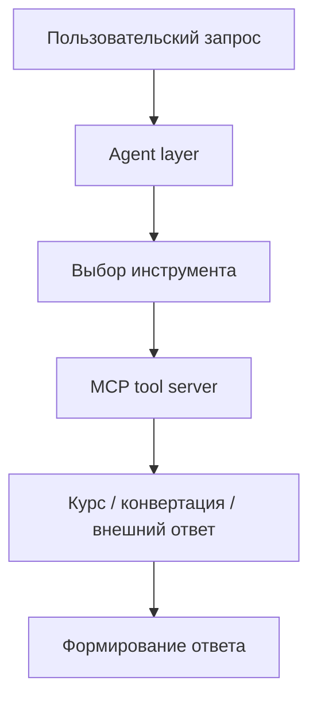

# Currency MCP Agent

## Кратко
Ассистент для сценариев с валютами на базе MCP: сервер инструментов, агентный слой, конфигурация, тесты и локальный запуск в контейнере.

## Задача
Сделать управляемый контур для сценариев, где агент не должен выполнять вычисления напрямую, а должен использовать структурированные инструменты для получения курсов, конвертации и связанных операций.

## Что улучшено
- разделение на agent и tool server делает систему прозрачнее и проще для тестирования;
- конфигурация и тесты упрощают воспроизводимость;
- MCP-подход даёт более чистую схему расширения набора инструментов, чем монолитный скрипт.

## Архитектура


## Метрики и результаты
| Сценарий | Корректность ответа | Корректность вызова инструмента | latency | Комментарий |
|---|---:|---:|---:|---|
| запрос курса валюты | TBD | TBD | TBD | |
| конвертация суммы | TBD | TBD | TBD | |
| некорректный ввод | TBD | TBD | TBD | |

Здесь важно показать не только корректность ответа, но и управляемость системы: inspectability, разделение ответственности, воспроизводимость сценариев.

## Структура репозитория
- `agent/` — логика оркестрации;
- `mcp_server/` — сервер инструментов;
- `config/` — конфигурация;
- `tests/` — автоматические проверки;
- `docker-compose.yml`, `Dockerfile` — контейнеризация.

## Запуск
```bash
python -m venv .venv
source .venv/bin/activate
pip install -r requirements.txt
docker compose up --build
```

## Ограничения
- проект ориентирован на локальный и воспроизводимый контур;
- набор инструментов ограничен валютными сценариями;
- без внешней системы наблюдаемости latency и отказоустойчивость измеряются локально.

## Направления развития
- добавить трассировку вызовов инструментов;
- расширить сценарии негативного тестирования;
- вынести спецификацию инструментов в отдельный документ;
- добавить режим сравнения нескольких стратегий выбора инструмента.
